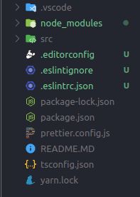

<h2 align="center">
   Template NodeJs + Typescript
</h2>

<h3 align="center">
  
</h3>
<hr/>


## 💡 Sobre o Repositório:

Este repositorio foi desenvolvido como template para NodeJs + Typescript, com todas as configurações feitas para rodar corretamente.

## 📐 Arquitetura:

;

## ⚙️ Techs:

- EsLint;
- Prettier;
- NodeJs;
- Typescript;
- Yarn;
- Ts-node-dev;

## 🏁 Para rodar o projeto:

Clone este repositório em sua máquina:

```bash
$ git clone https://github.com/araujooleticiaa/template-nodejs-typescript
```

cd `template-nodejs-typescript` e rode:

```bash
yarn
```

para iniciar:

```bash
yarn dev:server
```

<br/>

<h4 align="center">
  ---

Made with ♥ by Letícia Araújo :wave: [Get in touch!](https://www.linkedin.com/in/leticiaa-araujoo/)
</h4>

<br/>
